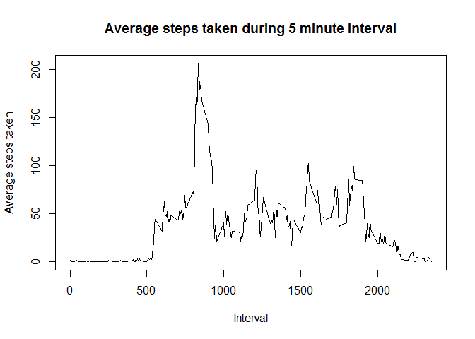
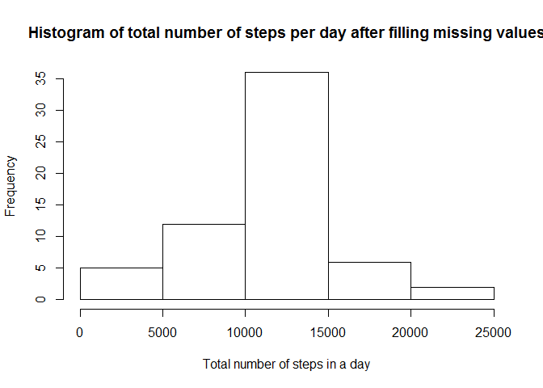
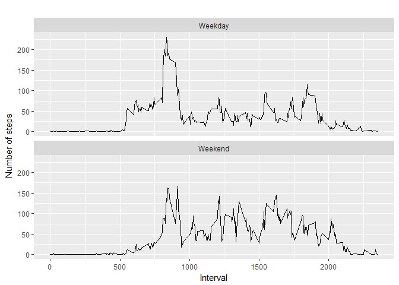

Reproducible Research- Peer Assessment 1
================
Bozidarka Jankovic
July 19, 2017

Introduction
------------

This assignment makes use of data from a personal activity monitoring device. This device collects data at 5 minute intervals through out the day. The data consists of two months of data from an anonymous individual collected during the months of October and November, 2012 and include the number of steps taken in 5 minute intervals each day.

The variables included in this dataset are:

steps: Number of steps taking in a 5-minute interval (missing values are coded as NA) date: The date on which the measurement was taken in YYYY-MM-DD format interval: Identifier for the 5-minute interval in which measurement was taken The dataset is stored in a comma-separated-value (CSV) file and there are a total of 17,568 observations in this dataset.

Loading and preprocessing the data
----------------------------------

The first step is to load the data and required packages. It is important to be sure that you have downloaded the activity file from the course site. Also we will download dplyr library, as it is necessary for the work.

``` r
data_row<-read.csv("activity.csv")
```

``` r
library(dplyr)
```


    Attaching package: 'dplyr'

    The following objects are masked from 'package:stats':

        filter, lag

    The following objects are masked from 'package:base':

        intersect, setdiff, setequal, union

What is mean total number of steps taken per day?
-------------------------------------------------

For this part of the assignment, you can ignore the missing values in the dataset.

1.  Calculate the total number of steps taken per day
2.  If you do not understand the difference between a histogram and a barplot, research the difference between them. Make a histogram of the total number of steps taken each day
3.  Calculate and report the mean and median of the total number of steps taken per day

``` r
# clean row data set of NA values
data<-na.omit(data_row)
head(data, 20)
```

        steps       date interval
    289     0 2012-10-02        0
    290     0 2012-10-02        5
    291     0 2012-10-02       10
    292     0 2012-10-02       15
    293     0 2012-10-02       20
    294     0 2012-10-02       25
    295     0 2012-10-02       30
    296     0 2012-10-02       35
    297     0 2012-10-02       40
    298     0 2012-10-02       45
    299     0 2012-10-02       50
    300     0 2012-10-02       55
    301     0 2012-10-02      100
    302     0 2012-10-02      105
    303     0 2012-10-02      110
    304     0 2012-10-02      115
    305     0 2012-10-02      120
    306     0 2012-10-02      125
    307     0 2012-10-02      130
    308     0 2012-10-02      135

``` r
#group data set per day
data_group<-group_by(data,date)
total_number_steps_per_date<-summarise(data_group,total_steps_per_day=sum(steps))
total_number_steps_per_date
```

    # A tibble: 53 x 2
             date total_steps_per_day
           <fctr>               <int>
     1 2012-10-02                 126
     2 2012-10-03               11352
     3 2012-10-04               12116
     4 2012-10-05               13294
     5 2012-10-06               15420
     6 2012-10-07               11015
     7 2012-10-09               12811
     8 2012-10-10                9900
     9 2012-10-11               10304
    10 2012-10-12               17382
    # ... with 43 more rows

Create a histogram of the total number of steps taken each day

``` r
hist(total_number_steps_per_date$total_steps_per_day,main="Histogram of total number of steps per day", 
     xlab="Total number of steps in a day")
```


Calculate and report the mean and median total number of steps taken per day

``` r
# mean of the total number of steps taken per day
mean_steps_per_day<-mean(total_number_steps_per_date$total_steps_per_day)
mean_steps_per_day
```

    [1] 10766.19

``` r
# mediana of the total number of steps taken per day
mediana_steps_per_day<-median(total_number_steps_per_date$total_steps_per_day)
mediana_steps_per_day
```

    [1] 10765

What is the average daily activity pattern?
-------------------------------------------

1.  Make a time series plot (i.e. type = "l") of the 5-minute interval (x-axis) and the average number of steps taken, averaged across all days (y-axis)
2.  Which 5-minute interval, on average across all the days in the dataset, contains the maximum number of steps?

``` r
#calulate average number of steps taken per inteval
#group data per inteval
data_group_interval<-group_by(data,interval)
#summarise avearge numebr of steps per interval
intervalav_steps<-summarise(data_group_interval,avr_steps_interval=mean(steps))
intervalav_steps
```

    # A tibble: 288 x 2
       interval avr_steps_interval
          <int>              <dbl>
     1        0          1.7169811
     2        5          0.3396226
     3       10          0.1320755
     4       15          0.1509434
     5       20          0.0754717
     6       25          2.0943396
     7       30          0.5283019
     8       35          0.8679245
     9       40          0.0000000
    10       45          1.4716981
    # ... with 278 more rows

``` r
plot(intervalav_steps$interval ,intervalav_steps$avr_steps_interval, type="l",
     xlab="Interval",
     ylab="Average steps taken",
     main="Average steps taken during 5 minute interval")
```



Which 5-minute interval, on average across all the days in the dataset, contains the maximum number of steps?

``` r
intervalav_steps$interval[which.max(intervalav_steps$avr_steps_interval)]
```

    [1] 835

Imputing missing values
-----------------------

Note that there are a number of days/intervals where there are missing values (coded as NA). The presence of missing days may introduce bias into some calculations or summaries of the data.

1.  Calculate and report the total number of missing values in the dataset (i.e. the total number of rows with NAs)
2.  Devise a strategy for filling in all of the missing values in the dataset. The strategy does not need to be sophisticated. For example, you could use the mean/median for that day, or the mean for that 5-minute interval, etc.
3.  Create a new dataset that is equal to the original dataset but with the missing data filled in.
4.  Make a histogram of the total number of steps taken each day and Calculate and report the mean and median total number of steps taken per day. Do these values differ from the estimates from the first part of the assignment? What is the impact of imputing missing data on the estimates of the total daily number of steps?

``` r
#Calculate and report the total number of missing values in the dataset (i.e. the total number of rows with NAs)
total_numer_NA<-sum(is.na(data_row) == TRUE)
total_numer_NA
```

    [1] 2304

``` r
#Strategy for filling in all of the missing values in the dataset. 
filldata<-data_row
for (i in 1:nrow(filldata)) {
  if(is.na(filldata$steps[i]) == TRUE)
  {
    tmp<-intervalav_steps$avr_steps_interval[which(intervalav_steps$interval==filldata$interval[i])]
    filldata$steps[i]<-tmp
    
  }
}
```

Make a histogram of the total number of steps taken each day and Calculate and report the mean and median total number of steps taken per day. Do these values differ from the estimates from the first part of the assignment? What is the impact of imputing missing data on the estimates of the total daily number of steps?

``` r
filled_missing_data<-group_by(filldata,date)

total_number_steps_per_date_after_cleaning<-summarise(filled_missing_data,total=sum(steps))
total_number_steps_per_date_after_cleaning
```

    # A tibble: 61 x 2
             date    total
           <fctr>    <dbl>
     1 2012-10-01 10766.19
     2 2012-10-02   126.00
     3 2012-10-03 11352.00
     4 2012-10-04 12116.00
     5 2012-10-05 13294.00
     6 2012-10-06 15420.00
     7 2012-10-07 11015.00
     8 2012-10-08 10766.19
     9 2012-10-09 12811.00
    10 2012-10-10  9900.00
    # ... with 51 more rows

``` r
hist(total_number_steps_per_date_after_cleaning$total,main="Histogram of total number of steps per day after filling missing values", 
     xlab="Total number of steps in a day")
```



``` r
mean(total_number_steps_per_date_after_cleaning$total)
```

    [1] 10766.19

``` r
median(total_number_steps_per_date_after_cleaning$total)
```

    [1] 10766.19

Conclusion:Comparing original and modified data There is no significant change in the results: the number of valid samples in the modified data is greater, so the total steps is also greater, but the histogram is very similar in shape, and the mean and median are practily the same

Are there differences in activity patterns between weekdays and weekends?
-------------------------------------------------------------------------

For this part the weekdays() function may be of some help here. Use the dataset with the filled-in missing values for this part.

1.  Create a new factor variable in the dataset with two levels - "weekday" and "weekend" indicating whether a given date is a weekday or weekend day.
2.  Make a panel plot containing a time series plot (i.e. type = "l") of the 5-minute interval (x-axis) and the average number of steps taken, averaged across all weekday days or weekend days (y-axis). See the README file in the GitHub repository to see an example of what this plot should look like using simulated data.

``` r
week_day <- function(date) {
  wd <- weekdays(as.Date(date, '%Y-%m-%d'))
  if  (!(wd == 'Saturday' || wd == 'Sunday')) {
    x <- 'Weekday'
  } else {
    x <- 'Weekend'
  }
  x
}
filled_missing_data$type_of_day<-unlist(lapply(filled_missing_data$date,week_day))
```

``` r
data_group_interval<-group_by(filled_missing_data,type_of_day,interval)
data_group_interval
```

    # A tibble: 17,568 x 4
    # Groups:   type_of_day, interval [576]
           steps       date interval type_of_day
           <dbl>     <fctr>    <int>       <chr>
     1 1.7169811 2012-10-01        0     Weekday
     2 0.3396226 2012-10-01        5     Weekday
     3 0.1320755 2012-10-01       10     Weekday
     4 0.1509434 2012-10-01       15     Weekday
     5 0.0754717 2012-10-01       20     Weekday
     6 2.0943396 2012-10-01       25     Weekday
     7 0.5283019 2012-10-01       30     Weekday
     8 0.8679245 2012-10-01       35     Weekday
     9 0.0000000 2012-10-01       40     Weekday
    10 1.4716981 2012-10-01       45     Weekday
    # ... with 17,558 more rows

``` r
intervalav_steps<-summarise(data_group_interval,avr_steps_interval=mean(steps))
intervalav_steps
```

    # A tibble: 576 x 3
    # Groups:   type_of_day [?]
       type_of_day interval avr_steps_interval
             <chr>    <int>              <dbl>
     1     Weekday        0         2.25115304
     2     Weekday        5         0.44528302
     3     Weekday       10         0.17316562
     4     Weekday       15         0.19790356
     5     Weekday       20         0.09895178
     6     Weekday       25         1.59035639
     7     Weekday       30         0.69266247
     8     Weekday       35         1.13794549
     9     Weekday       40         0.00000000
    10     Weekday       45         1.79622642
    # ... with 566 more rows

``` r
library(ggplot2)

qplot(interval, 
      avr_steps_interval, 
      data = intervalav_steps, 
      type = 'l', 
      geom=c("line"),
      xlab = "Interval", 
      ylab = "Number of steps", 
      main = "") +
  facet_wrap(~ type_of_day, ncol = 1)
```

    Warning: Ignoring unknown parameters: type



CONCLUSION: There is a different pattern of steps for weekdays and weekends. It can be seen that the activity is more spread during the day during the weekends, are more concentrated during weekdays
